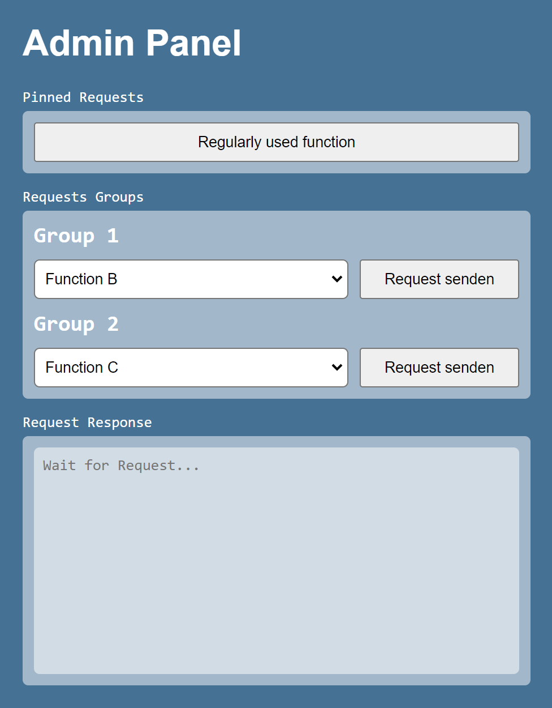

# Cpp-Admin-Panel

Do you have a C++ project without a user interface and want to trigger specific functions at runtime for testing purposes or process control?

This C++ class enables users to execute custom functions via a web-based admin panel using HTTP requests. With this tool, you can effortlessly run your own helper functions or test cases in real-time, making it an excellent choice for dynamically interfacing with your C++ application.

## Features

- **Header Only**: Lightweight and header-only for easy integration.
- **Dynamic Function Execution**: Define your own functions and trigger them in real-time through the admin panel.
- **Grouping**: Organize functions into groups for better categorization and user-friendliness.
- **Pinned Functions**: Pin frequently used functions for quick access.
- **HTTP Interface**: Communicate with the admin panel via HTTP requests.
- **Customizable**: Change the title to manage multiple instances.

## Admin Panel Interface



## Example

```cpp
#include "admin-panel.h"

// Definition of functions you want to call via admin panel
namespace ADMIN_PANEL_FUNCTIONS
{
void function_a(httplib::Response& res)
{
res.set_content("function_a() has been called", "plain/text");
}

    void function_b(httplib::Response& res)
    {
        res.set_content("function_b() has been called", "plain/text");
    }

    void function_c(httplib::Response& res)
    {
        res.set_content("function_c() has been called", "plain/text");
    }

    void function_d(httplib::Response& res)
    {
        res.set_content("function_d() has been called", "plain/text");
    }

}

int main()
{
    // Structuring admin panel functions
    std::map<std::string, ADMIN_PANEL::admin_function> admin_functions = {

        {"f1", {"Group 1", "Regularly used function", true, &ADMIN_PANEL_FUNCTIONS::function_a}},
        {"f2", {"Group 1", "Function B", false, &ADMIN_PANEL_FUNCTIONS::function_b}},
        {"f3", {"Group 2", "Function C", false, &ADMIN_PANEL_FUNCTIONS::function_c}},
        {"f4", {"Group 2", "Function D", false, &ADMIN_PANEL_FUNCTIONS::function_d}},
    };

    // Initialize and start admin panel
    ADMIN_PANEL::PANEL admin_panel(96, admin_functions, "Admin Panel");

    // Prevent console from closing
    std::getchar();
}

```

## How to map your functions?

In the example map:

- `"f1"`, `"f2"`, `"f3"`, `"f4"`: These are unique keys for each function. They serve as identifiers for the functions within the map.

- `"Group 1"`, `"Group 2"`: These define the function groups for better categorization and separate visualization within the admin panel.

- `"Regularly used function"`, `"Function B"`, `"Function C"`, `"Function D"`: These are the user-friendly names of the functions as they will be displayed in the admin panel.

- `true`, `false`: These values indicate whether each function is marked as "pinned" (`true`) or not (`false`). Pinned functions can be highlighted or accessed more quickly in the admin panel.

- `&ADMIN_PANEL_FUNCTIONS::function_a`, `&ADMIN_PANEL_FUNCTIONS::function_b`, `&ADMIN_PANEL_FUNCTIONS::function_c`, `&ADMIN_PANEL_FUNCTIONS::function_d`: These function pointers reference the actual function implementations. It's important to note that these functions must include the `httplib::Response& res` parameter in order to respond to admin requests.

This map is used to define and organize custom functions that can be called and managed through the admin panel of your C++ application.

## Dependencies

Before you can use this C++ Admin Panel, you need to ensure that you have the following dependencies installed:

- **httplib.h**: This library is used for creating the HTTP server that powers the admin panel. You can download it from [here](https://github.com/yhirose/cpp-httplib).

Please make sure to install these dependencies in your C++ application before integrating and running the admin panel. You can follow the installation instructions provided in the respective libraries' documentation.

By installing these dependencies, you'll have the necessary components to run the C++ Admin Panel seamlessly in your project.

## Getting Started

1. Install the httplib.h
2. Include the `admin-panel.h` header at the beginning of your main C++ file
3. Initialize the Admin Panel as demonstrated in the example provided
4. Access the admin panel via a web browser by navigating to `http://localhost:96`
